# EXNO-6-DS-DATA VISUALIZATION USING SEABORN LIBRARY

# Aim:
  To Perform Data Visualization using seaborn python library for the given datas.

# EXPLANATION:
Data visualization is the graphical representation of information and data. By using visual elements like charts, graphs, and maps, data visualization tools provide an accessible way to see and understand trends, outliers, and patterns in data.

# Algorithm:
STEP 1:Include the necessary Library.

STEP 2:Read the given Data.

STEP 3:Apply data visualization techniques to identify the patterns of the data.

STEP 4:Apply the various data visualization tools wherever necessary.

STEP 5:Include Necessary parameters in each functions.

# Coding and Output:
```python
import pandas as pd
import matplotlib.pyplot as plt
import numpy as np
import seaborn as sns
df = sns.load_dataset('tips')
df
```


<div id="df-563e1891-5aad-497f-b62a-9e36fa0d85d6" class="colab-df-container">
<div>
<table border="1" class="dataframe">
<thead>
<tr style="text-align: right;">
<th></th>
<th>total_bill</th>
<th>tip</th>
<th>sex</th>
<th>smoker</th>
<th>day</th>
<th>time</th>
<th>size</th>
</tr>
</thead>
<tbody>
<tr>
<th>0</th>
<td>16.99</td>
<td>1.01</td>
<td>Female</td>
<td>No</td>
<td>Sun</td>
<td>Dinner</td>
<td>2</td>
</tr>
<tr>
<th>1</th>
<td>10.34</td>
<td>1.66</td>
<td>Male</td>
<td>No</td>
<td>Sun</td>
<td>Dinner</td>
<td>3</td>
</tr>
<tr>
<th>2</th>
<td>21.01</td>
<td>3.50</td>
<td>Male</td>
<td>No</td>
<td>Sun</td>
<td>Dinner</td>
<td>3</td>
</tr>
<tr>
<th>3</th>
<td>23.68</td>
<td>3.31</td>
<td>Male</td>
<td>No</td>
<td>Sun</td>
<td>Dinner</td>
<td>2</td>
</tr>
<tr>
<th>4</th>
<td>24.59</td>
<td>3.61</td>
<td>Female</td>
<td>No</td>
<td>Sun</td>
<td>Dinner</td>
<td>4</td>
</tr>
<tr>
<th>...</th>
<td>...</td>
<td>...</td>
<td>...</td>
<td>...</td>
<td>...</td>
<td>...</td>
<td>...</td>
</tr>
<tr>
<th>239</th>
<td>29.03</td>
<td>5.92</td>
<td>Male</td>
<td>No</td>
<td>Sat</td>
<td>Dinner</td>
<td>3</td>
</tr>
<tr>
<th>240</th>
<td>27.18</td>
<td>2.00</td>
<td>Female</td>
<td>Yes</td>
<td>Sat</td>
<td>Dinner</td>
<td>2</td>
</tr>
<tr>
<th>241</th>
<td>22.67</td>
<td>2.00</td>
<td>Male</td>
<td>Yes</td>
<td>Sat</td>
<td>Dinner</td>
<td>2</td>
</tr>
<tr>
<th>242</th>
<td>17.82</td>
<td>1.75</td>
<td>Male</td>
<td>No</td>
<td>Sat</td>
<td>Dinner</td>
<td>2</td>
</tr>
<tr>
<th>243</th>
<td>18.78</td>
<td>3.00</td>
<td>Female</td>
<td>No</td>
<td>Thur</td>
<td>Dinner</td>
<td>2</td>
</tr>
</tbody>
</table>
<p>244 rows × 7 columns</p>
</div>
<div class="colab-df-buttons">

<div class="colab-df-container">


</div>


<div id="id_18feb0de-a90a-4af5-9ffe-83ad633e8a68">
</div>

</div>
</div>


```python
sns.lineplot(x='total_bill',y='tip',data=df,hue='sex',linestyle='solid',legend="auto")
```


<Axes: xlabel='total_bill', ylabel='tip'>


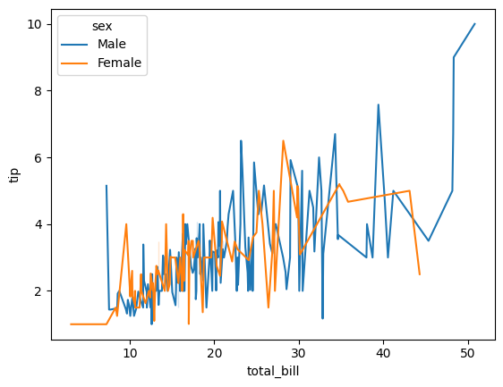


```python
av_tb = df.groupby('day')['total_bill'].mean()
av_ti = df.groupby('day')['tip'].mean()
plt.figure(figsize=(8,6))
p1 = plt.bar(av_tb.index,av_tb,label='Total Bill')
p2 = plt.bar(av_ti.index,av_ti,bottom=av_tb,label='Tip')
plt.xlabel("Day of the week")
plt.ylabel("Amount")
plt.title("Average Total Bill and Tip by Day")
plt.legend()
```

/tmp/ipykernel_213/2092385980.py:1: FutureWarning: The default of observed=False is deprecated and will be changed to True in a future version of pandas. Pass observed=False to retain current behavior or observed=True to adopt the future default and silence this warning.
av_tb = df.groupby('day')['total_bill'].mean()
/tmp/ipykernel_213/2092385980.py:2: FutureWarning: The default of observed=False is deprecated and will be changed to True in a future version of pandas. Pass observed=False to retain current behavior or observed=True to adopt the future default and silence this warning.
av_ti = df.groupby('day')['tip'].mean()


<matplotlib.legend.Legend at 0x7e3368263d70>


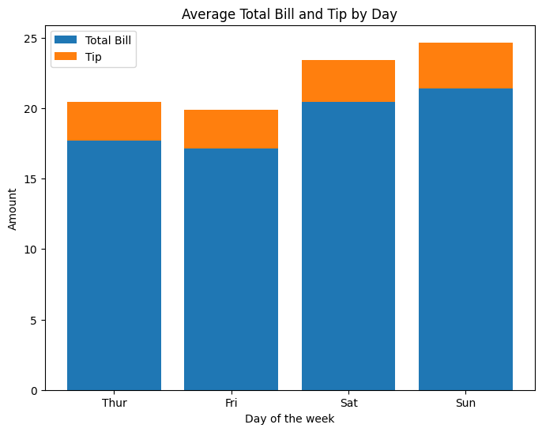


```python
sns.barplot(x='day',y='tip',data=df,hue='sex',palette='Set2')
plt.xlabel("Day of the week")
plt.ylabel("Amount")
plt.title("Average Total Bill and Tip by Gender")
plt.legend()
```


<matplotlib.legend.Legend at 0x7e33678cffb0>


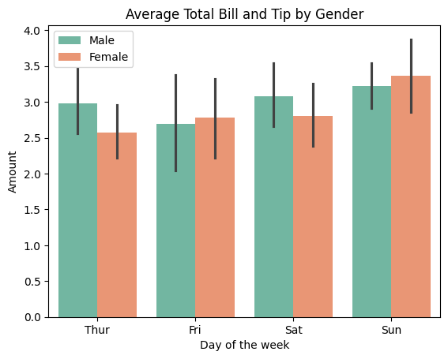


```python
sns.scatterplot(x='total_bill',y='tip',data=df,hue='sex')
plt.xlabel("Bill Amount")
plt.ylabel("Tip Amount")
plt.title("Bill VS Tip")
plt.legend()
```


<matplotlib.legend.Legend at 0x7e33678dc410>


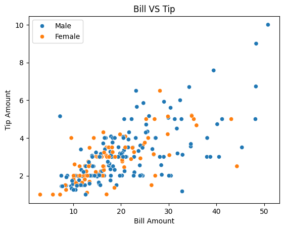


```python
np.random.seed(0)
mark = np.random.normal(loc=70,scale=10,size=100)
mark
```


array([87.64052346, 74.00157208, 79.78737984, 92.40893199, 88.6755799 ,
60.2272212 , 79.50088418, 68.48642792, 68.96781148, 74.10598502,
71.44043571, 84.54273507, 77.61037725, 71.21675016, 74.43863233,
73.33674327, 84.94079073, 67.94841736, 73.13067702, 61.45904261,
44.47010184, 76.53618595, 78.64436199, 62.5783498 , 92.69754624,
55.45634325, 70.45758517, 68.1281615 , 85.32779214, 84.6935877 ,
71.54947426, 73.7816252 , 61.12214252, 50.19203532, 66.52087851,
71.56348969, 82.30290681, 82.02379849, 66.12673183, 66.97697249,
59.51447035, 55.79982063, 52.93729809, 89.50775395, 64.90347818,
65.61925698, 57.4720464 , 77.77490356, 53.86102152, 67.8725972 ,
61.04533439, 73.86902498, 64.89194862, 58.19367816, 69.71817772,
74.28331871, 70.66517222, 73.02471898, 63.65677906, 66.37258834,
63.27539552, 66.40446838, 61.86853718, 52.73717398, 71.77426142,
65.98219064, 53.69801653, 74.62782256, 60.92701636, 70.51945396,
77.29090562, 71.28982911, 81.39400685, 57.6517418 , 74.02341641,
63.15189909, 61.29202851, 64.21150335, 66.88447468, 70.56165342,
58.34850159, 79.00826487, 74.6566244 , 54.63756314, 84.88252194,
88.95889176, 81.78779571, 68.20075164, 59.29247378, 80.54451727,
65.96823053, 82.2244507 , 72.08274978, 79.76639036, 73.56366397,
77.06573168, 70.10500021, 87.85870494, 71.26912093, 74.01989363])


```python
sns.histplot(data=mark,bins=10,kde=True,stat='count',cumulative=False,multiple='stack',element='bars',palette='Set1',shrink=0.7)
plt.xlabel("Marks")
plt.ylabel("Density")
plt.title("Histogram of students marks")
```

/tmp/ipykernel_213/158066179.py:1: UserWarning: Ignoring `palette` because no `hue` variable has been assigned.
sns.histplot(data=mark,bins=10,kde=True,stat='count',cumulative=False,multiple='stack',element='bars',palette='Set1',shrink=0.7)


Text(0.5, 1.0, 'Histogram of students marks')


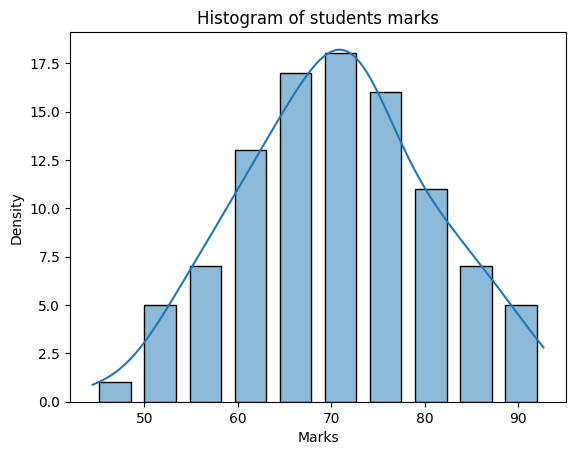


```python
sns.histplot(data=df,x="total_bill",hue='sex',bins=20,kde=True,palette="Set2")
```


<Axes: xlabel='total_bill', ylabel='Count'>


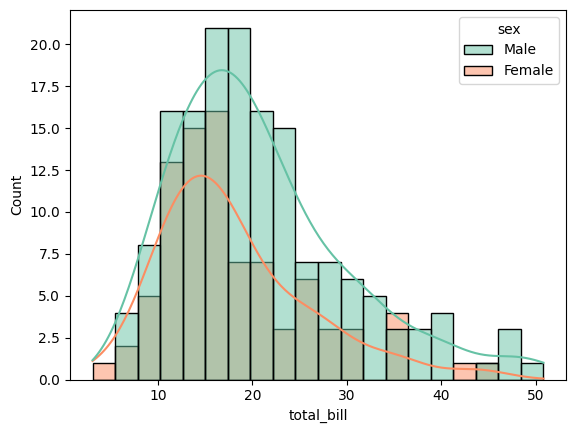


```python
sns.boxplot(data=df,x="day",y='total_bill',hue='sex')
```


<Axes: xlabel='day', ylabel='total_bill'>


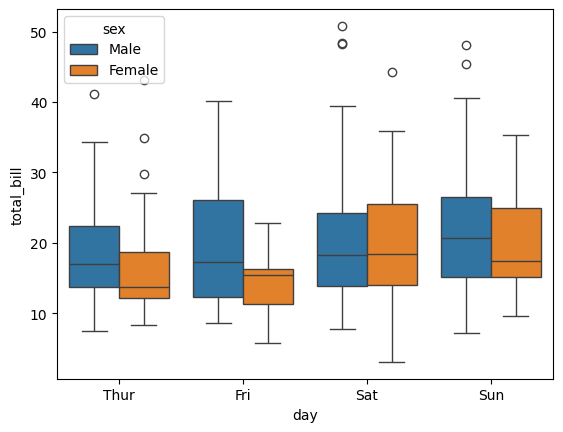


```python
sns.boxplot(data=df,x="day",y='total_bill',hue='smoker',linewidth=2,width=0.6,flierprops={'color':'pink'},boxprops={'facecolor':'cyan','edgecolor':'darkgreen'},whiskerprops={'color':'grey','linestyle':"--",'linewidth':1.5},capprops={'color':'red','linestyle':'--','linewidth':1.5},medianprops={'color':'black','linewidth':2})
```


<Axes: xlabel='day', ylabel='total_bill'>


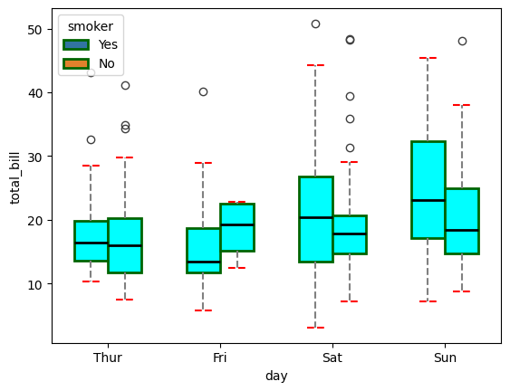


```python
df = sns.load_dataset('tips')
sns.violinplot(data=df,x='day', y='total_bill', hue="smoker", linewidth=2, width=0.6, palette="Set3", inner="quartile")
plt.xlabel("Day of the Week")
plt.ylabel("Total Bill")
plt.title("Violin Plot of Total Bill by Day and Smoker Status")
```


Text(0.5, 1.0, 'Violin Plot of Total Bill by Day and Smoker Status')


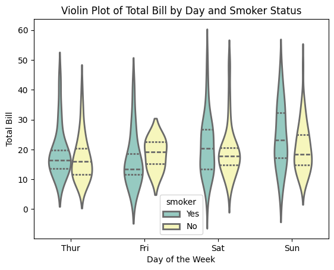


```python
dfn=pd.read_csv("titanic_dataset.csv")
sns.histplot(data=df,x="Pclass", hue="Survived", kde=True)
```


<Axes: xlabel='Pclass', ylabel='Count'>


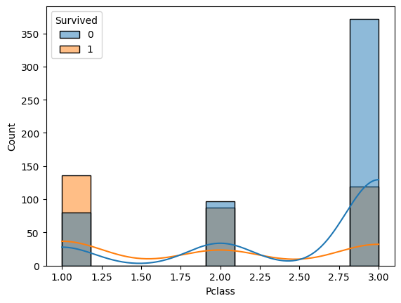


```python
dfn=dfn[['PassengerId', 'Survived', 'Age', 'Name', 'Ticket', 'Embarked']]
dfn.head(10)
```


<div id="df-68551cfd-1e1b-44ae-a85f-7ccaf0c3838f" class="colab-df-container">
<div>
<table border="1" class="dataframe">
<thead>
<tr style="text-align: right;">
<th></th>
<th>PassengerId</th>
<th>Survived</th>
<th>Age</th>
<th>Name</th>
<th>Ticket</th>
<th>Embarked</th>
</tr>
</thead>
<tbody>
<tr>
<th>0</th>
<td>1</td>
<td>0</td>
<td>22.0</td>
<td>Braund, Mr. Owen Harris</td>
<td>A/5 21171</td>
<td>S</td>
</tr>
<tr>
<th>1</th>
<td>2</td>
<td>1</td>
<td>38.0</td>
<td>Cumings, Mrs. John Bradley (Florence Briggs Th...</td>
<td>PC 17599</td>
<td>C</td>
</tr>
<tr>
<th>2</th>
<td>3</td>
<td>1</td>
<td>26.0</td>
<td>Heikkinen, Miss. Laina</td>
<td>STON/O2. 3101282</td>
<td>S</td>
</tr>
<tr>
<th>3</th>
<td>4</td>
<td>1</td>
<td>35.0</td>
<td>Futrelle, Mrs. Jacques Heath (Lily May Peel)</td>
<td>113803</td>
<td>S</td>
</tr>
<tr>
<th>4</th>
<td>5</td>
<td>0</td>
<td>35.0</td>
<td>Allen, Mr. William Henry</td>
<td>373450</td>
<td>S</td>
</tr>
<tr>
<th>5</th>
<td>6</td>
<td>0</td>
<td>NaN</td>
<td>Moran, Mr. James</td>
<td>330877</td>
<td>Q</td>
</tr>
<tr>
<th>6</th>
<td>7</td>
<td>0</td>
<td>54.0</td>
<td>McCarthy, Mr. Timothy J</td>
<td>17463</td>
<td>S</td>
</tr>
<tr>
<th>7</th>
<td>8</td>
<td>0</td>
<td>2.0</td>
<td>Palsson, Master. Gosta Leonard</td>
<td>349909</td>
<td>S</td>
</tr>
<tr>
<th>8</th>
<td>9</td>
<td>1</td>
<td>27.0</td>
<td>Johnson, Mrs. Oscar W (Elisabeth Vilhelmina Berg)</td>
<td>347742</td>
<td>S</td>
</tr>
<tr>
<th>9</th>
<td>10</td>
<td>1</td>
<td>14.0</td>
<td>Nasser, Mrs. Nicholas (Adele Achem)</td>
<td>237736</td>
<td>C</td>
</tr>
</tbody>
</table>
</div>
<div class="colab-df-buttons">

<div class="colab-df-container">


</div>


</div>
</div>


```python
sns.kdeplot(data=dfn,x='PassengerId')
```


<Axes: xlabel='PassengerId', ylabel='Density'>


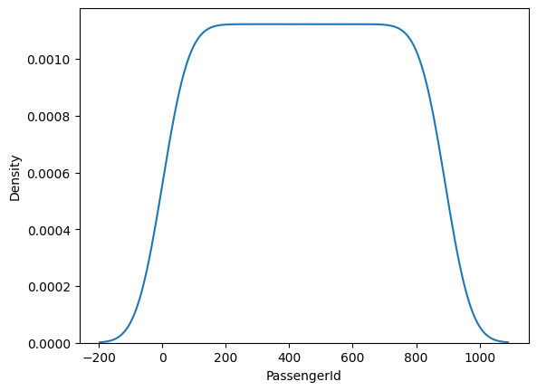


```python
sns.kdeplot(data=dfn,x='Age')
```


<Axes: xlabel='Age', ylabel='Density'>


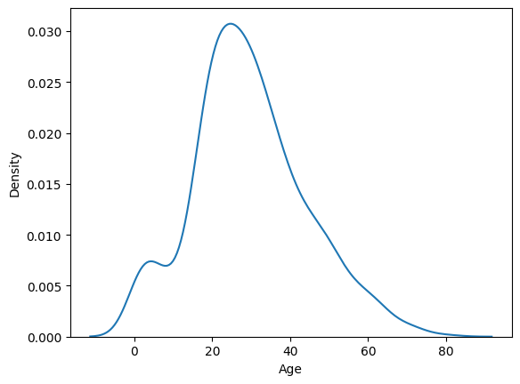


```python
sns.kdeplot(data=dfn)
```


<Axes: ylabel='Density'>


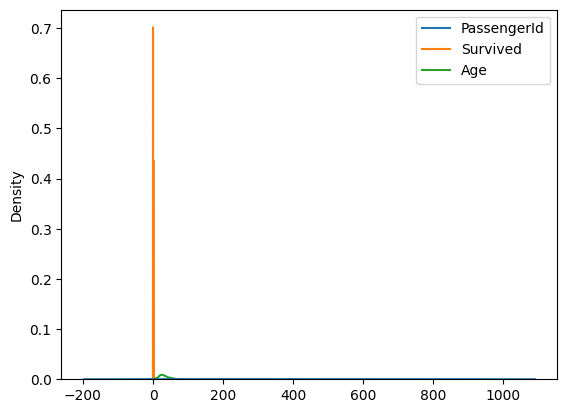


```python
sns.kdeplot(data=dfn,x='PassengerId',hue='Survived',multiple='stack')
```


<Axes: xlabel='PassengerId', ylabel='Density'>


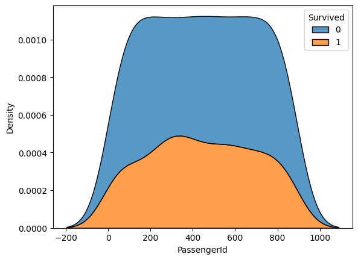


```python
sns.kdeplot(data=dfn,x='PassengerId',y='Survived')
```


<Axes: xlabel='PassengerId', ylabel='Survived'>


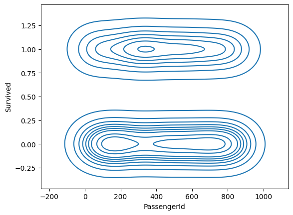


```python
data = np.random.randint(low = 1, high = 100, size = (10,10))
hm=sns.heatmap(data=data,annot=True)
```


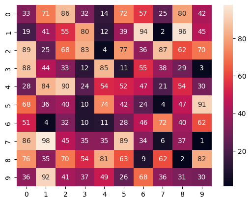


```python
hm=sns.heatmap(data=data)
```


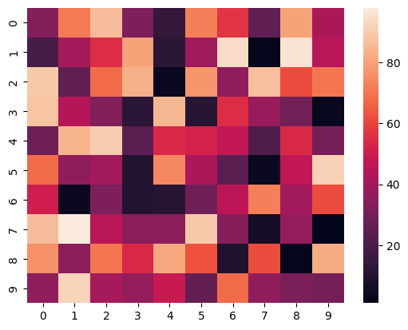


# Result:
Thus, all the data visualization techniques of seaborn has been implemented.
